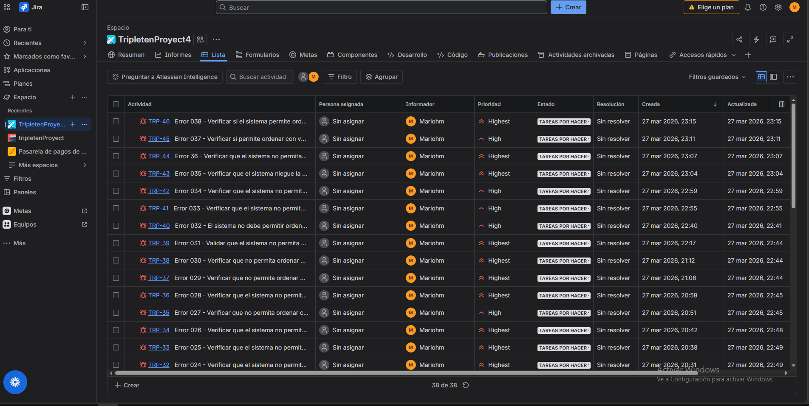

  

# 🛒 QA Testing – E-commerce Project

Proyecto de testing enfocado en validar la calidad de una plataforma e-commerce mediante pruebas manuales y de API.

---

## 📌 Objetivo
Asegurar el correcto funcionamiento del sistema, identificando errores críticos y validando flujos clave del usuario.

---

## 🧪 Alcance de pruebas
- Pruebas funcionales (registro, login, compra)
- Validación de APIs con Postman
- Gestión de bugs en Jira
- Creación y ejecución de casos de prueba

---

## 🛠️ Herramientas utilizadas
- Postman (API Testing)
- Jira (Bug tracking)
- Test case design
- Navegadores web

---

## 📋 Entregables
- ✔️ Casos de prueba documentados
- ✔️ Evidencia de ejecución
- ✔️ Reporte de bugs
- ✔️ Colección de Postman

---

## 📸 Evidencia

### 🔹 Gestión de bugs en Jira

---

## 💡 Resultados
- Identificación de errores críticos en flujos de compra
- Mejora en la estabilidad del sistema
- Validación completa de endpoints principales

---

## 👨‍💻 Autor
Mario Huichapan  
QA Engineer (en formación)

---
